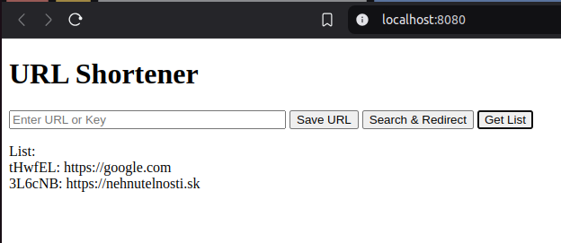

# go-url-shortener
URL Shortener API that helps shorten long URLs.

# Prerequisites

`Docker`

# Build docker image

```sh
docker build -t url-shortener .
```

# Run docker container

```sh
docker run -it --rm -v $(pwd):/workspace --workdir /workspace -p 8080:8080 url-shortener bash
```

# Run app in docker

```sh
mongod --fork --logpath /var/log/mongodb/mongod.log
go mod tidy
go run url-shortener
```

# Usage examples

`POST` method is used to save a url to db and assign a unique key to it  
`PUT` method is used to modify an existing url  
`GET` method is used to obtain existing url from the db, obtain stats for that url, or list up to 10 existing urls in the form of key-url pairs    
`DELETE` method is used to delete an existing url from the db  

```sh
curl -X POST -d '{"url": "http://someurl"}' localhost:8080/shorten
# {"_id":"674996324dc4add438c190e6","url":"http://someurl","shortCode":"fwVydA","createdAt":"2024-11-29T10:23:46Z","updatedAt":"2024-11-29T10:23:46Z"}
curl localhost:8080/shorten/fwVydA
# {"_id":"674996324dc4add438c190e6","url":"http://someurl","shortCode":"fwVydA","createdAt":"2024-11-29T10:23:46Z","updatedAt":"2024-11-29T10:23:46Z"}
curl localhost:8080/shorten/fwVydA/stats
# {"_id":"674996324dc4add438c190e6","url":"http://someurl","shortCode":"fwVydA","createdAt":"2024-11-29T10:23:46Z","updatedAt":"2024-11-29T10:23:46Z","accessCount":1}
curl -X PUT -d '{"url": "http://someotherurl"}' localhost:8080/shorten/fwVydA
# {"url":"http://someotherurl","shortCode":"fwVydA","createdAt":"2024-11-29T10:23:46Z","updatedAt":"2024-11-29T10:25:27Z"}
curl -v -X DELETE localhost:8080/shorten/fwVydA
# < HTTP/1.1 204 No Content
```

# Testing

```sh
go test ./...
```

## FrontEnd

There's also a simple frontend on `localhost:8080/` with 3 buttons
 

`Save URL` checks whether the URL provided is valid and saves it to the db, assigning it a unique key  
`Search & Redirect` looks up the key in the db and redirects to the respective page if such url was found  
`Get List` lists up to 10 key-url pairs stored in the db  

# Roadmap reference
https://roadmap.sh/projects/url-shortening-service
